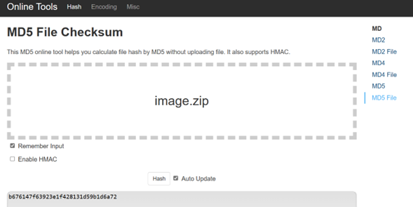
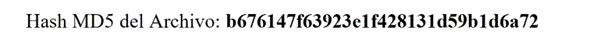
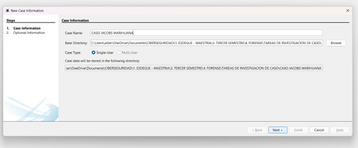
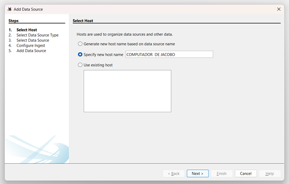
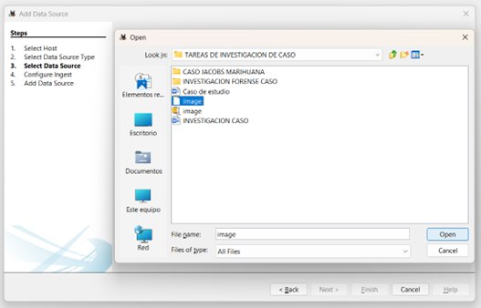
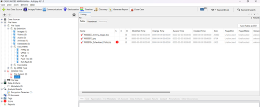
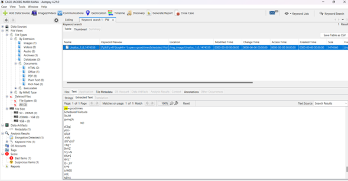
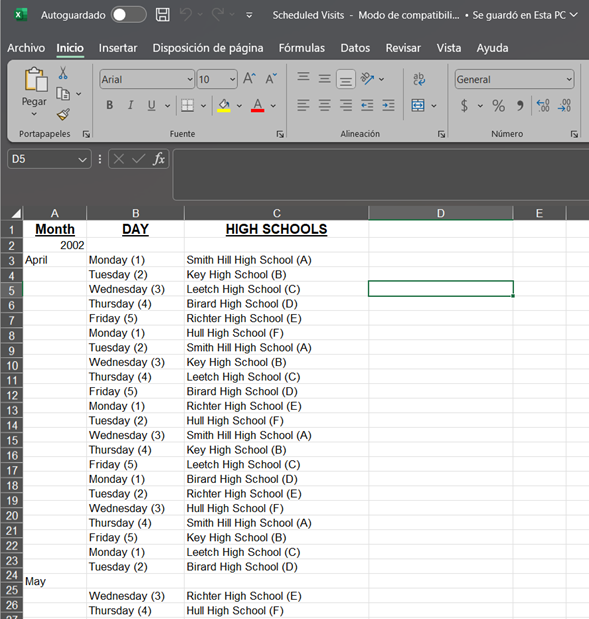
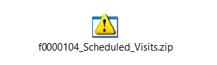

# Análisis Forense Digital con Autopsy

## Caso: Joe Jacobs – Distribución de Sustancias Ilícitas

**Investigador:** Jaider Ospina Navas

---

## Contexto del Caso

Joe Jacobs, de 28 años, fue arrestado bajo sospecha de distribución de drogas a estudiantes de secundaria. La detención se produjo tras un operativo encubierto en el estacionamiento de **Smith Hill High School**, donde Jacobs ofreció marihuana a un agente que se hacía pasar por estudiante.

Durante el encuentro, Jacobs afirmó:

> *“¡Mira esto, los colombianos no podrían cultivarla mejor! Mi proveedor no sólo me la vende directamente, sino que la cultiva él mismo.”*

Este comentario despertó el interés de las autoridades, quienes buscan identificar al proveedor y determinar si Jacobs operaba en otras instituciones educativas.

A pesar de las sospechas, Jacobs:

* Niega haber vendido drogas en otras escuelas.
* Se niega a revelar la identidad de su proveedor.
* No valida sus declaraciones previas.

### Evidencia incautada

Tras una orden de registro, la policía obtuvo:

* Una pequeña cantidad de marihuana.
* **Un disquete (floppy disk)** sin otros dispositivos asociados.

Se generó una **imagen forense del disquete**, la cual constituye la base de este análisis.

---

## Objetivos de la Investigación

1. Identificar al proveedor de marihuana de Joe Jacobs y su dirección.
2. Analizar el archivo `f0000073.jpg` y determinar su relevancia.
3. Identificar otras escuelas frecuentadas por el sospechoso.
4. Determinar técnicas de ocultamiento o manipulación de archivos.
5. Documentar los procedimientos forenses aplicados.

---

## Validación de la Evidencia

Antes de iniciar el análisis, se verificó la integridad del archivo:

### 1. Descarga de la imagen forense

Archivo: `image.zip`

### 2. Verificación de hash (MD5)

Se utilizó `md5sum` para comprobar la integridad:

Resultado:

**Conclusión:** La evidencia es íntegra y no ha sido alterada.

---

## Metodología de Análisis (Autopsy)

Se utilizó la herramienta **Autopsy** para el análisis forense digital.

### 🔹 Creación del caso

* Nombre del caso: `CASO JACOBS MARIHUANA`
* Número: `CASO 001 - FORENSE`

### 🔹 Configuración del entorno

* Host: `COMPUTADOR DE JACOBO`
* Tipo de fuente: `Unallocated Space Image File`

### 🔹 Carga de la evidencia

Se importó la imagen forense del disquete para su análisis completo:

---

## Hallazgos Forenses

### Archivos eliminados recuperados

Se identificaron **tres archivos eliminados**, lo que indica intento de ocultamiento:

---

### Análisis del archivo `Jimmy_Jungle.doc`

Este documento contiene una comunicación clave entre Jacobs y su proveedor.

#### Contenido relevante (traducción):

* Confirma que el proveedor **cultiva su propia marihuana**.
* Sugiere un modelo de distribución enfocado en estudiantes.
* Hace referencia a:

  * Un archivo con horarios.
  * Una contraseña compartida previamente.

---

### Archivo protegido: `f0000104_Scheduled_Visits.zip`

Mediante búsqueda de palabras clave (**Keyword Search**), se identificó la contraseña:

**Contraseña:** `goodtimes`

Tras descomprimir el archivo:

---

### Archivo `f0000073.jpg`

Este archivo contiene un dato crítico:

**La contraseña "goodtimes"**

**Importancia:**
Permite acceder al archivo comprimido que contiene la evidencia principal de distribución.

---

##  Técnicas de Ocultamiento Identificadas

El sospechoso aplicó múltiples técnicas para evadir detección:

* Eliminación de archivos.
* Compresión de información sensible.
* Protección con contraseña.
* Distribución fragmentada de información (contraseña en imagen).

---

## Procedimientos Forenses Aplicados

1. Verificación de integridad (hash MD5).
2. Análisis de imagen forense con Autopsy.
3. Recuperación de archivos eliminados.
4. Análisis de contenido documental.
5. Búsqueda de palabras clave.
6. Identificación de credenciales ocultas.
7. Descompresión de archivos protegidos.
8. Correlación de evidencia.

---

## Resultados de la Investigación

### 1. Proveedor identificado

* **Nombre:** Jimmy Jungle
* **Dirección:** 626 Jungle Ave, Apt 2, Jungle, NY 11111

---

### 2. Dato crucial en `f0000073.jpg`

* Contiene la contraseña `goodtimes`.
* Permite acceder a evidencia crítica.

---

### 3. Escuelas frecuentadas

* Birard High School
* Hull High School
* Key High School
* Leetch High School
* Richter High School
* Smith Hill High School

---

### 4. Técnicas de ocultamiento

* Compresión con contraseña.
* Eliminación de archivos.
* Uso de archivos aparentemente inocuos para almacenar datos sensibles.

---

### 5. Proceso de análisis

* Recuperación de datos eliminados.
* Análisis de documentos.
* Identificación de credenciales.
* Acceso a archivos protegidos.
* Consolidación de evidencia.

---

## Conclusión

El análisis forense demuestra de manera consistente que:

* Joe Jacobs no operaba únicamente en Smith Hill High School.
* Existía una red de distribución activa hacia múltiples instituciones.
* El proveedor, identificado como **Jimmy Jungle**, cultivaba y suministraba la sustancia.
* El sospechoso implementó técnicas básicas de ocultamiento digital, pero estas fueron superadas mediante análisis forense estructurado.

Este caso evidencia la importancia del análisis de **medios digitales aparentemente obsoletos** (como disquetes) y cómo pueden contener información crítica en investigaciones criminales.

---

