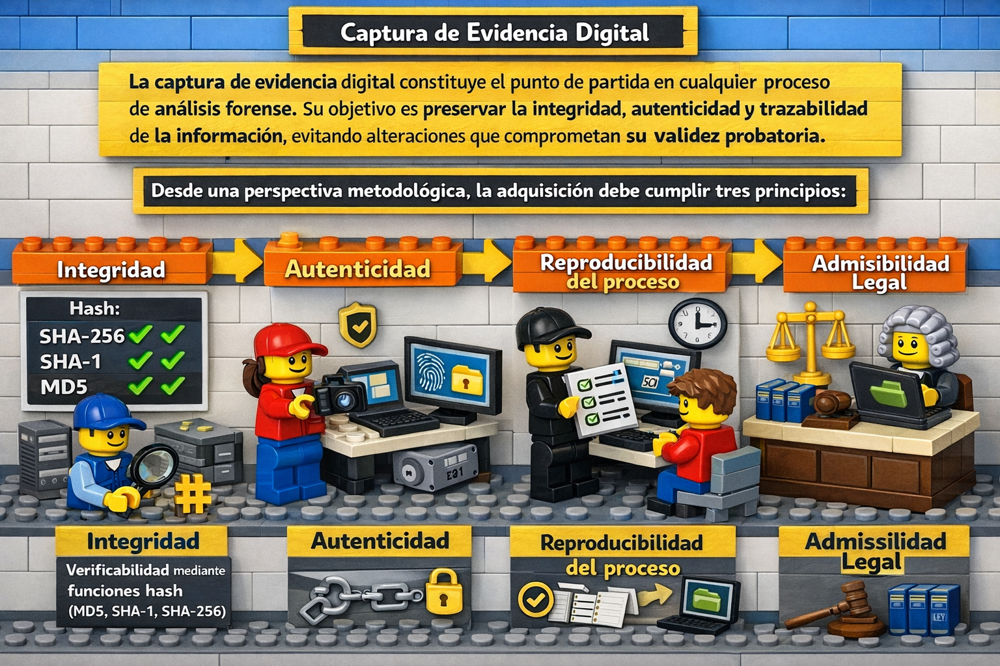
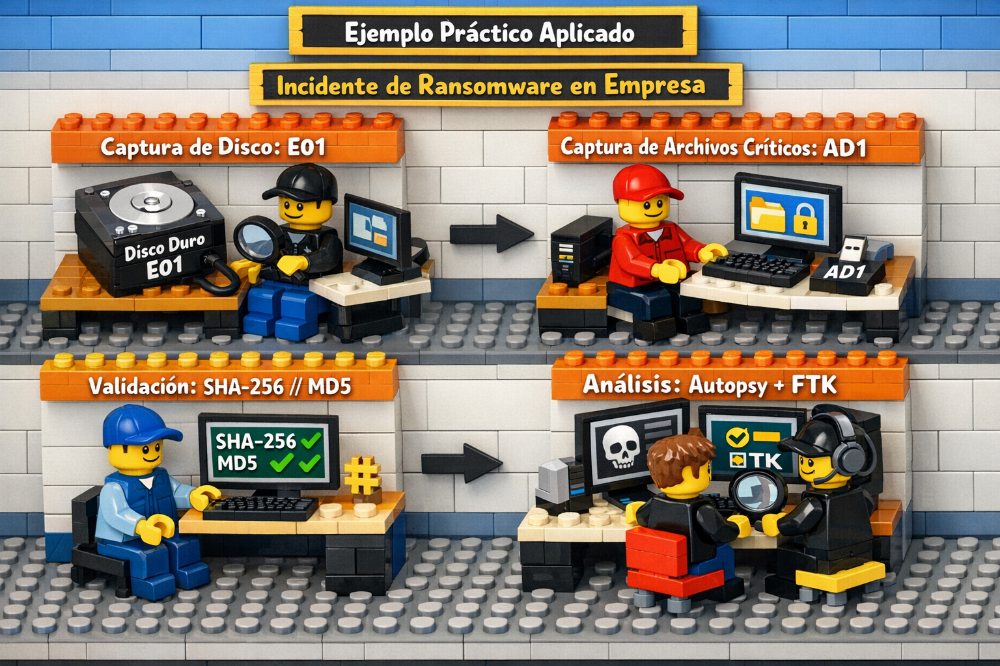

# **FORMATOS DE CAPTURA DE EVIDENCIA FORENSE DIGITAL**

## **1. Fundamentación de la captura forense**

La captura de evidencia digital constituye el punto de partida en cualquier proceso de análisis forense. Su objetivo es **preservar la integridad, autenticidad y trazabilidad de la información**, evitando alteraciones que comprometan su validez probatoria.

Desde una perspectiva metodológica, la adquisición debe cumplir tres principios:

* **Integridad**  --> **Verificabilidad mediante funciones hash (MD5, SHA-1, SHA-256)**
* **Autenticidad**
* **Reproducibilidad del proceso**
* **Admisibilidad legal**

El formato de captura elegido impacta directamente en estos principios, así como en la **capacidad de análisis posterior**.

---

## Definición de Imagen forense:

Una **imagen forense** es una copia exacta (bit a bit) de un medio digital (disco, RAM, USB, etc.), incluyendo:

* Espacio asignado
* Espacio no asignado
* Sectores ocultos
* Metadatos del sistema de archivos

Se basa en el principio de:

* **No alteración del original**
* Uso de hashes (MD5, SHA-1, SHA-256)

---

## Clasificación de formatos de evidencia

Los formatos se pueden agrupar en tres categorías principales:

### 1. Formatos RAW (Crudos)

### 2. Formatos propietarios

### 3. Formatos abiertos/avanzados

---

## Tipos de Adquisición

### Captura física

* Copia bit a bit de todo el dispositivo.
* Incluye espacio no asignado y sectores ocultos.
* Permite recuperar información eliminada.

### Captura lógica

* Copia de archivos visibles del sistema.
* Más rápida, pero menos completa.
* No incluye datos borrados.

### Captura en vivo

* Se realiza con el sistema encendido.
* Permite obtener datos volátiles (RAM, procesos activos).
* Riesgo de alterar el sistema.

---

## Formatos Más Empleados de captura de evidencia

### FORMATO RAW / DD (Formato crudo)

**Descripción:**

Es el formato más básico. Consiste en una copia exacta bit a bit del medio.

**Características:**

* Copia bit a bit sin estructura adicional.
* Sin compresión
* Sin metadatos estructurados
* Alta compatibilidad
* Generado comúnmente con herramientas como `dd`.

**Ventajas:**

* Simplicidad
* Máxima fidelidad
* Universalmente soportado
* Ideal para análisis profundo

**Desventajas:**

* Tamaño de archivo grande
* No incluye información contextual del caso

**Extensión común:**
`.dd`, `.img`, `.raw`

**Casos de uso:**

* Laboratorios académicos
* Procesos donde se prioriza pureza de datos

---

### Formato EWF (Expert Witness Format)  – E01

**Descripción:**
Formato desarrollado para herramientas como EnCase. Es uno de los más utilizados en entornos forenses profesionales.

**Características:**

* Permite compresión
* Segmentación en múltiples archivos
* Incluye metadatos (caso, investigador, fecha)

**Ventajas:**

* Reduce el tamaño del almacenamiento
* Mantiene integridad mediante hashes
* Facilita la documentación del proceso
* Checksums por bloque
* Amplio soporte en herramientas

**Desventajas:**

* Formato propietario (aunque documentado)
* Dependencia de herramientas compatibles
* Menor transparencia que RAW

**Extensión común:**
`.E01`

**Casos de uso:**

* Investigaciones judiciales
* Entornos corporativos

---

### 3.3 Formato AFF (Advanced Forensic Format)

**Descripción:**
Formato abierto diseñado para superar limitaciones del RAW y EWF.

**Características:**

* Código abierto
* Soporte para metadatos extensos
* Compresión opcional

**Ventajas:**

* Flexibilidad
* Transparencia (formato documentado)
* Integración de datos adicionales (notas, hashes)

**Desventajas:**

* Menor adopción en herramientas comerciales
* Curva de aprendizaje mayor

**Extensión común:**
`.aff`, `.afd` (dividido), `.afm` (metadatos separados)

---

### 3.4 Formato SMART (ASR Data)

**Descripción:**
Utilizado por herramientas específicas como ASR Data.

**Características:**

* Incluye verificación de integridad
* Permite segmentación

**Ventajas:**

* Seguro y confiable
* Optimizado para ciertos entornos

**Desventajas:**

* Poco estandarizado
* Dependencia de software específico

---

### 3.5 Formato AD1 (AccessData Logical Image)

**Descripción:**
Formato propietario de AccessData., orientado a adquisiciones lógicas. Empleado por FTK.

**Características:**

* No es imagen completa del disco
* Contiene archivos seleccionados

**Ventajas:**

* Ligero
* Rápido de generar

**Desventajas:**

* No permite recuperación de datos eliminados
* Menor valor probatorio en algunos casos

---

## Comparación de formatos

| Criterio                  | RAW (dd)   | EWF (E01) | AFF       | AD1       |
| ------------------------- | ---------- | --------- | --------- | --------- |
| Tipo de captura           | Física     | Física    | Física    | Lógica    |
| Compresión                | No         | Sí        | Opcional  | Sí        |
| Metadatos                 | No         | Sí        | Sí        | Sí        |
| Integridad (hash)         | Externo    | Integrado | Integrado | Integrado |
| Tamaño de archivo         | Muy grande | Reducido  | Variable  | Bajo      |
| Compatibilidad            | Muy alta   | Alta      | Media     | Media     |
| Transparencia del formato | Alta       | Media     | Alta      | Baja      |

---

###  Criterios de selección del formato.

1. ### Según el contexto

| Contexto                | Formato recomendado |
| ----------------------- | ------------------- |
| Judicial                | E01                 |
| Investigación académica | RAW / AFF           |
| Respuesta a incidentes  | E01 / AD1           |
| Análisis rápido         | AD1                 |

2. ### Según el tamaño del medio

* Discos grandes → E01 (compresión)
* Discos pequeños → RAW viable

3. ### Según herramientas disponibles

Ejemplo:

* EnCase → E01
* FTK → AD1 / E01
* Autopsy/Sleuth Kit → RAW / AFF

---

## **Buenas prácticas en la captura**

* Uso de **write blockers** para evitar escritura en el dispositivo original.
* Generación de **hash antes y después** de la adquisición.
* Documentación detallada (cadena de custodia).
* Almacenamiento en medios seguros y redundantes.
* Validación de la imagen adquirida.

---

##  Flujo de captura recomendado

### Paso a paso:

1. **Aislamiento del dispositivo**
2. **Uso de bloqueador de escritura (write blocker)**
3. **Selección del formato:**

   * RAW → análisis puro
   * E01 → uso judicial
   * AFF → investigación avanzada
4. **Generación de hash:**

   * Antes
   * Después
5. **Documentación:**

   * Fecha/hora
   * Herramienta
   * Investigador
6. **Custodia de evidencia.**

---
## Conclusión

No existe un “mejor formato universal”. La elección depende de:

* Objetivo de la investigación
* Requisitos legales
* Herramientas disponibles
* Volumen de datos

Sin embargo:

* **E01** es el estándar de facto en entornos judiciales
* **RAW** sigue siendo el más transparente
* **AFF** es el más flexible técnicamente
* **AD1** es útil para análisis lógico rápido

---

## Ejemplo práctico aplicado

**Escenario:** Incidente de ransomware en empresa

* Captura de disco: E01
* Captura de archivos críticos: AD1
* Validación: SHA-256 // MD5
* Análisis: Autopsy + FTK

---

## **Reflexión final**

La elección del formato de captura no es una decisión meramente técnica; implica considerar el equilibrio entre **fidelidad, eficiencia y admisibilidad legal**. Mientras el formato RAW representa la pureza de la evidencia, formatos como EWF introducen una capa de estructuración que facilita su manejo en contextos reales de investigación.

En la práctica forense, más que privilegiar un único formato, resulta pertinente comprender sus alcances y limitaciones, de modo que la captura responda de manera coherente a los objetivos del análisis y a las exigencias del contexto jurídico.

---
